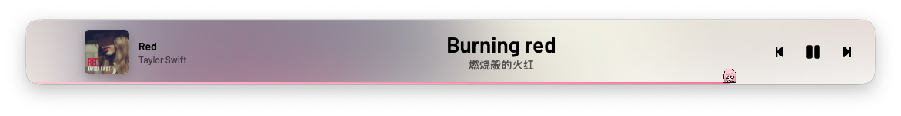

<p align="center">
  
</p>

<h2 align="center" style="font-weight: 600">YesPlayMusic</h2>

<p align="center">高颜值的第三方网易云播放器</p>
<p align="center"><sub>macOS 定制分支 · 迷你播放器与菜单栏歌词 · 由 <a href="https://github.com/nagi-studio">Nagi Studio</a> 维护</sub></p>

---

## 关于这个仓库

这是从 [qier222/YesPlayMusic](https://github.com/qier222/YesPlayMusic) 分出来独立维护的分支，
不再跟随上游发版，专注打磨 macOS 上的使用体验。原项目的功能和界面基本保留，
下面这些是这个版本额外做的事。

如果你是来找原版的，请直接去[上游仓库](https://github.com/qier222/YesPlayMusic)，
那边有完整的跨平台安装包和文档。

**欢迎提 Issue 和 PR。** 尤其是 Windows 和 Linux，那两个平台还缺一部分功能，
[详见下面](#关于-windows-和-linux)。

## 这个版本改了什么

**迷你播放器。** 把窗口拖窄（宽度小于 620 或高度小于 340）就会自动变成一条紧凑的播放条，
左边小封面配歌名歌手，中间是当前这句歌词，右边是播放控制。空间够的时候原文下面还会跟一行
中文翻译，纯音乐则显示「纯音乐，请欣赏」。拖回大窗口自动还原成完整歌词页。
原版最小窗口是 1080×720，这里放开到了 300×48。



**窗口置顶。** 迷你条上有个图钉按钮，点一下把窗口钉在最上层，切到别的桌面或者全屏应用上面
它也会跟着走，适合一边干活一边扫一眼歌词。按钮平时藏着，鼠标移到播放条上才浮现，
开关状态会记住，下次启动还在。迷你模式下红绿灯也默认收起，悬浮时才出现。

**macOS 菜单栏歌词。** 菜单栏图标位置直接显示专辑封面，右边跟着当前歌词走。
文字按显示宽度截断而不是字符数，所以中日文和英文都能显示得比较满。迷你条开着的时候
菜单栏只留封面，不重复显示一遍歌词；窗口一收起，歌词立刻补回菜单栏。


**Anon 进度条。** 在原有的彩虹猫之外多加了一种进度条皮肤，设置里可以切换，两者互斥。

**修了一个切歌的老问题。** 网络慢的时候快速切歌，前一首的歌词响应可能晚于后一首到达，
把新歌的歌词覆盖成上一首的。现在请求前会记住是哪首歌，回来发现已经切歌就直接丢弃。

**换掉了整套构建工具。** 原来的 Vue CLI 4（webpack 4）在新版 Node 上跑不起来，
开发模式也拉不起窗口。现在是 Vite 7 加 electron-vite 5，Electron 升到 43，
构建时间从三四分钟降到一秒半，改完代码存盘就生效。Vue 2 的业务代码没有动。

## 安装

到 [Releases](https://github.com/nagi-studio/YesPlayMusic/releases) 下载 dmg，
Apple Silicon 选 `arm64`，Intel 选 `x64`。

安装包没有签名，首次打开时 macOS 会拦一道。放行方法二选一：

- 打开「系统设置 → 隐私与安全性」，往下翻到被拦截的提示，点「仍要打开」
- 或者在终端跑一句：`xattr -dr com.apple.quarantine /Applications/YesPlayMusic.app`

自己从源码构建的话没有这个问题，本地产物不带隔离属性。

## 自己构建

需要 [bun](https://bun.sh)，Node 20 以上（Node 26 实测可用）。

```bash
cp .env.example .env   # 必须，缺了它前端拿不到 API 地址，界面会全空
bun install
bun run dev            # 开发，主进程和渲染进程都热重载
bun run build:app      # 出 macOS 安装包
```

`.env` 不进版本库，但 `.env.example` 里已经是一份可以直接用的完整配置，
不需要自己去申请任何密钥。

产物在 `dist_electron/`，把 `mac-arm64/YesPlayMusic.app` 拷进 `/Applications` 就能用。

开发细节和踩过的坑都记在 [CLAUDE.md](CLAUDE.md) 里。

## 关于 Windows 和 Linux

这个版本只在 macOS 上开发和测试，CI 也只跑 macOS。上游原有的 Windows 和 Linux
代码都还在，`electron-builder.yml` 里也配好了打包目标，`bun run build:win` 和
`build:linux` 本地能跑出包。

但**上面那些新功能不是全都跨平台的**：

| 功能 | Windows / Linux |
| --- | --- |
| 迷你播放器、双语歌词 | 可用 |
| 窗口置顶 | 可用 |
| Anon 进度条 | 可用 |
| 切歌歌词错位的修复 | 可用 |
| 菜单栏封面与歌词 | **未实现**，只有 macOS 有 |
| 迷你模式自动收起窗口按钮 | **未实现**，这是 macOS 独有的接口 |

菜单栏那部分是写在 `src/electron/tray.js` 的 `YPMTrayMacImpl` 里的，Windows 和 Linux
走的还是上游原来的托盘实现，收不到 `updateNowPlaying` 事件，所以不会报错，就是没有效果。
想补的话照着 macOS 那个类实现一份就行。

真跑通了，把 `.github/workflows/build.yaml` 里对应的 job 取消注释（已经写好放在那儿），
这个仓库很乐意把它们变成正式支持的平台。

## 致谢

这个项目的一切都建立在 [qier222](https://github.com/qier222) 和
[YesPlayMusic 所有贡献者](https://github.com/qier222/YesPlayMusic/graphs/contributors)
的工作之上。播放器内核、界面设计、歌词、音乐库、网易云 API 的对接，这些真正困难的部分
都是他们写好的，这个分支只是在上面加了几个自己想要的功能。

同样感谢这些被项目依赖的开源工作：

- [NeteaseCloudMusicApi](https://github.com/Binaryify/NeteaseCloudMusicApi) 及其
  [维护分支](https://github.com/neteasecloudmusicapienhanced/api)：网易云 API 的实现
- [UnblockNeteaseMusic](https://github.com/UnblockNeteaseMusic/server)：灰色歌曲解锁
- [Vue](https://vuejs.org)、[Vite](https://vite.dev)、[Electron](https://www.electronjs.org)

界面设计的灵感来自 [Apple Music](https://music.apple.com)、
[YouTube Music](https://music.youtube.com) 和 [Spotify](https://www.spotify.com)。

## 截图

以下界面来自上游，这个分支没有改动。

![歌词页][lyrics-screenshot]

![音乐库（深色）][library-dark-screenshot]

![专辑][album-screenshot]

## 开源许可

沿用上游的 [MIT license](https://opensource.org/licenses/MIT)。

仅供个人学习研究使用，禁止用于商业及非法用途。音乐版权归网易云音乐及各版权方所有。

<!-- MARKDOWN LINKS & IMAGES -->

[album-screenshot]: images/album.png
[lyrics-screenshot]: images/lyrics.png
[library-dark-screenshot]: images/library-dark.png
